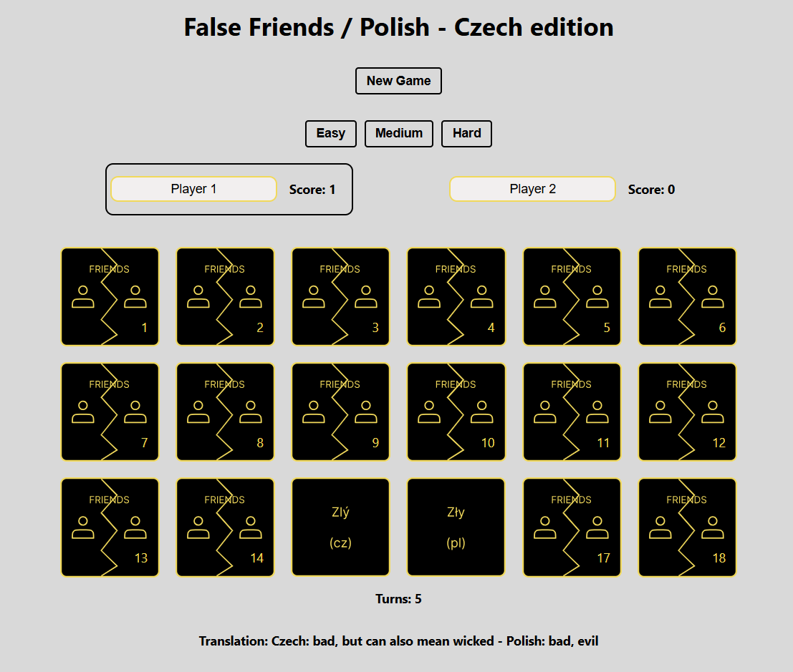

# False Friends - memory game challenge (Polish - Czech edition)

Thank you for stopping by. I would like to present to you project, which currently I am working on. Idea for this project came by watching a Youtube channel dedicated to languages and mutual intelligibility between them. For this project I created in Figma cards and use React.

## How to open project

Copy link from repository and using comman git clone paste after that link:

### `git clone (copied link)`

### `cd (name-of-filed)`

Now you can install npm by running:

### `npx install`

After installation use this command:

### `npm run start`

And now you can play, enjoy!
